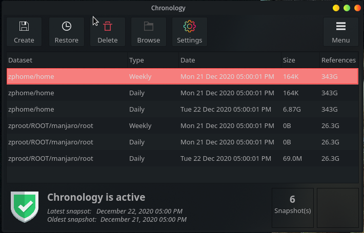
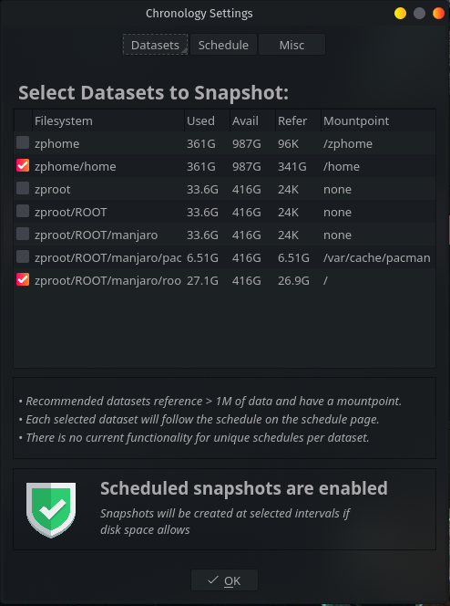
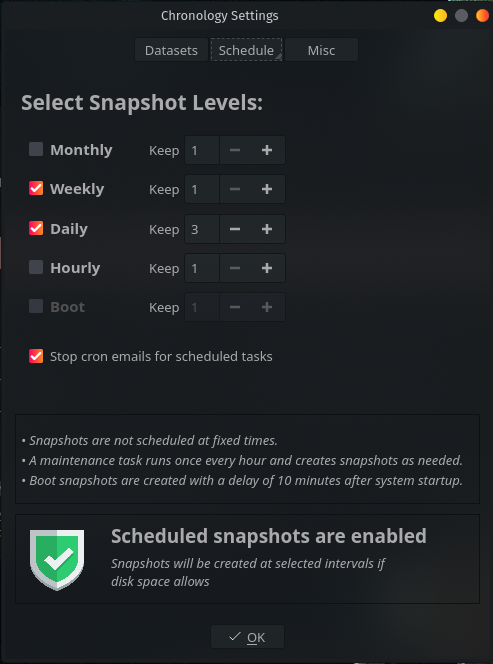
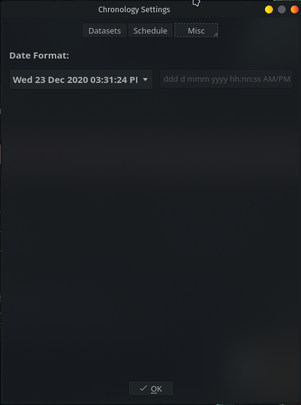

# chronology
Snapshot manager for ZFS

# Note
This is a work in progress project I whipped up in Lazarus to manage ZFS snapshots. 
I'm getting a surprising number of cloners on this project.  Please be aware that currently it probably only works on KDE, and definitely only works on Linux.  It requires Dolphin to be installed, since xdg-open was giving me some issues.  Given the suprising response, I'll put some more time into it than I had planned and try to iron out some of the wrinkles.  If you're looking for something like this and Chronology doesn't currently work for you, keep checking back.

# What works so far:
Everything essential.

# What doesn't work:
Nothing that isn't bugged.

# The Good:
Goals are being accomplished, and it's pretty. 

# The Bad:
I haven't used pascal in 20 years, and it's slow progress. 
The API for libzfs is mind bogglingly bad.  Or, at least hard to use.  I don't want to shit on anyone else's work.  However, I had to say the nay no to making pascal bindings for it.  That being the case, I'm system calling the ZFS CLI.  I will proably create a C wrapper library for libzfs in the future and make pascal bindings for that. 

# The Ugly:
Some of the code is hacky and amateurish, due to "The Bad". 
I see Major Refactoring in my future. 
As it's both bad and ugly, I'll reiterate that I'm system calling the ZFS CLI.

# Building and Installation
You'll need to install Lazarus with the qt5 bindings.  On Arch: 'pacman -Sy lazarus-qt5' 
Clone the repository 
cd chronology (or whatever you checked out out as) 
./build.sh 
Edit support/chronology.cron and change the paramater to -u to your user name 
./install.sh 

That should be all it takes.  If I start getting requests, I may work on a Gtk version. 

I hope it works for you and you enjoy it. 

# Images:

